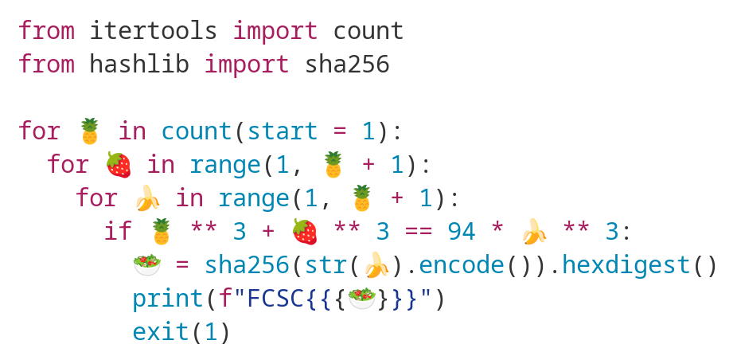

# FCSC 2024 - salade de fruits

## Énoncé
Ce dépôt est une réponse au problème ***salade de fruits***, dans la catégorie ***crypto*** du ***FCSC 2024***, ayant eu lieu du 08/04/2024 au 14/04/2024.

Ce dépôt a pour but d'expliquer le raisonnement m'ayant permis de trouver la solution du challenge, et de partager un exemple de script pouvant calculer la solution.

Sur le site, le problème se présente de la manière suivante:

Le fichier est également mit à disposition ([ici](salade-de-fruits.py)) si nécessaire.

## Récriture du problème

Le programme de l'énoncé comprend 3 boucles incrémentant chacune une variable. Pour la suite, on pose:

$$\begin{array}{ll}
	X=pineapple \\
	Y=strawberry \\
	Z=banana
\end{array}$$


De part la nature des boucles *for* de l'énoncé, il est aussi possible de préciser l'ensemble de définition de ces variables:

$$(X,Y,Z) \in \mathbb{N}^{3*}$$

Le script va alors tester toutes les combinaisons de $(X,Y,Z)$ jusqu'à ce que l'égalité suivante soit validée:

$$X^3+Y^3=94 Z^3$$

En supposant qu'une telle solution existe, le script python de l'énoncé permet théoriquement de trouver une solution au problème. Cependant, la complexité $O(N^3)$ des trois boucles imbriquées rend impossible son utilisation tel quel. Il nous faut donc trouver une méthode plus rapide.


En procédant aux étapes suivantes:
$X^3+Y^3=94 Z^3$  
$\Leftrightarrow \frac{X^3+Y^3}{Z^3}=94$ car $Z\ne 0$
$\Leftrightarrow \frac{X^3}{Z^3}+\frac{Y^3}{Z^3}=94$  
$\Leftrightarrow (\frac{X}{Z})^3+(\frac{Y}{Z})^3=94$  car la fonction cube étant strictement croissante sur $\mathbb{N}$

Nous définissons : $a=\frac{X}{Z},b=\frac{Y}{Z}$  
On notera également que $(a,b) \in \mathbb{Q}^{2+*}$

Ainsi:

$(\frac{X}{Z})^3+(\frac{Y}{Z})^3=94$
$\Leftrightarrow a^3+b^3=94$

Cette équation est de la forme :
$$\Leftrightarrow a^3+b^3=N$$
D'après [cette archive](https://web.archive.org/web/20100125133830/http://maths.paisley.ac.uk/allanm/ecrnt/twocubes/twocubes.htm), comme $94\equiv 4 \pmod 9$, il existe au moins une solution au problème (prouvé par *Noam Elkies* d'après l'archive, mais je n'ai pas pu trouver l'article d'origine évoqué dedans).

Il est possible d'établir que cette équation est birationnellement équivalente à la courbe elliptique suivante, définie sur $\mathbb{Q}$:

$E:u^3-432N^2=v^2$

Avec:

$a=\frac{36N+v}{6u}$
$b=\frac{36N-v}{6u}$

Nous devons alors trouver des couples $(u_{s},v_{s}) \in \mathbb{Q}^{2}$  appartenant à la courbe $E$.

De plus, nous ne nous intéressons qu'aux solutions telles que $(a,b) \in \mathbb{Q}^{2+*}$.
En utilisant les formules de passages de $(u,v)$ à $(a,b)$, nous pouvons déduire que les expressions suivantes sont de même signe:  

$\begin{array}{ll}
	6u \\
	36N+v \\
	36N-v
\end{array}$

Cela est possible uniquement si:  

$$\begin{array}{ll}
	u>0 \\
	\mid v \mid < 36N
\end{array}$$

Nous devons également vérifier que le couple $a$ et $b$ ont le même dénominateur, une fois obtenu via $u$ et $v$.

## Recherche de la solution

Plusieurs outils numériques existent pour trouver des candidats $(u_{s},v_{s})$. L'un d'entre eux est le logiciel open-source **SageMath** (voir [ici](https://www.sagemath.org/)) qui utilise une syntaxe compatible avec python.

Il existe une multitude de moyens d'utiliser *Sage*, celle que j'ai choisi est d'écrire un script python (avec l'extension ***.sage*** au lieu de ***.py***) et de demande au moteur de l'exécuter.

Sur des distributions Linux, il est possible d'installer ce moteur via un gestionnaire de paquet (avec apt, il s'agit du paquet *sagemath*).

Ce script est disponible dans sa totalité dans ce dépôt, [ici](script.sage).

Cette partie détaille les étapes de ce script.

```
from hashlib import sha256
from datetime import datetime
```
Seule la librairie *hashlib* est nécessaire, pour calculer l'empreinte de la solution $Z$ trouvée et répondre au challenge.
```
N=94
max_num=100
```
La variable `N` nous permet d'exprimer plus facilement les calculs qui suivront.
`max_num` est une précaution pour sortir de la boucle de recherche de solution.

```
def reverse_nums(u,v):
	a = (36*N+v)/(6*u)
	b = (36*N-v)/(6*u)
	return a,b
```
Cette fonction nous permet de retrouver $(a,b)$ à partir de $(u,v)$
```
def put_in_file(x,y,z,sign):
	with open("res.txt", 'a') as f:
		f.write("=================================\n")
		f.write("found for N="+str(N)+", at "+str(datetime.now())+"\n")
		f.write("X="+str(x)+"\n")
		f.write("Y="+str(y)+"\n")
		f.write("Z="+str(z)+"\n")
		f.write("SHA="+str(sign)+"\n")
```
Quand une solution est trouvée, nous pouvons la noter dans le fichier `res.txt` pour ne pas la perdre.
```
R.<u,v> = QQ[]
E= EllipticCurve(u^3-432*N**2-v^2)
```
Nous définissons les variables `u` et `v`, qui nous permettent d'exprimer notre courbe elliptique $E$ via un polynôme, en utilisant le constructeur `EllipticCurve(polynomial)`.
```
print(E)
print("With rank "+str(E.rank()))
```
Par précaution, nous vérifions que la courbe décrite est la bonne.
```
P=E.gens()[0]
```
La fonction `gens()` (définie [ici](https://doc.sagemath.org/html/en/reference/arithmetic_curves/sage/schemes/elliptic_curves/ell_finite_field.html#sage.schemes.elliptic_curves.ell_finite_field.EllipticCurve_finite_field.gens)) est utilisée pour récupérer un premier couple $(u,v)$ appartenant à $E$.

```
i=1
while(True):
	P_i = i*P
	if P_i[0] > 0 and abs(P_i[1]) < 36*N:
		a,b = reverse_nums(P_i[0], P_i[1])
		if (a.denom()==b.denom()):
			x=a.numer()
			y=b.numer()
			z=a.denom()
			if x^3+y^3 == N*z^3:
				signature = sha256(str(z).encode()).hexdigest()
				print("signature=")
				print(f"FCSC{{{signature}}}")
				put_in_file(x,y,z,signature)
				print("success")
				break
			else:
				print("fail")
	if i == max_num:
		break
	i+=1
```
En multipliant le point `P` par un entier, nous pouvons tester plusieurs une multitudes de points appartenant également à $E$.

Si l'une de ses solutions `P_i` réussit le test `P_i[0] > 0 and abs(P_i[1]) < 36*N` (où `u=P_i[0]` et `v=P_i[1]`), alors on en déduit $(a,b)$ et on vérifie le dénominateur.

On vérifie une dernière fois que l'équation de départ est respectée, et nous notons cette solution dans `res.txt`, avant d'afficher l'empreinte *SHA256* de $Z$ à l'utilisateur.

Malgré la taille démesurée de ces nombres, permet de trouver très rapidement une solution.

## Quelques sources
Ci-dessous des pages m'ayant aidé à trouver cette solution:
 * https://math.stackexchange.com/questions/1195035/large-initial-solutions-to-x3y3-nz3?noredirect=1&lq=1
 * https://crypto.stackexchange.com/questions/43013/what-does-birational-equivalence-mean-in-a-cryptographic-context
 * https://fr.wikipedia.org/wiki/G%C3%A9om%C3%A9trie_birationnelle
 * https://math.stackexchange.com/questions/1605182/sum-of-two-cubes-transformed-to-elliptic-curve
 * https://web.archive.org/web/20100125133830/http://maths.paisley.ac.uk/allanm/ecrnt/twocubes/twocubes.htm